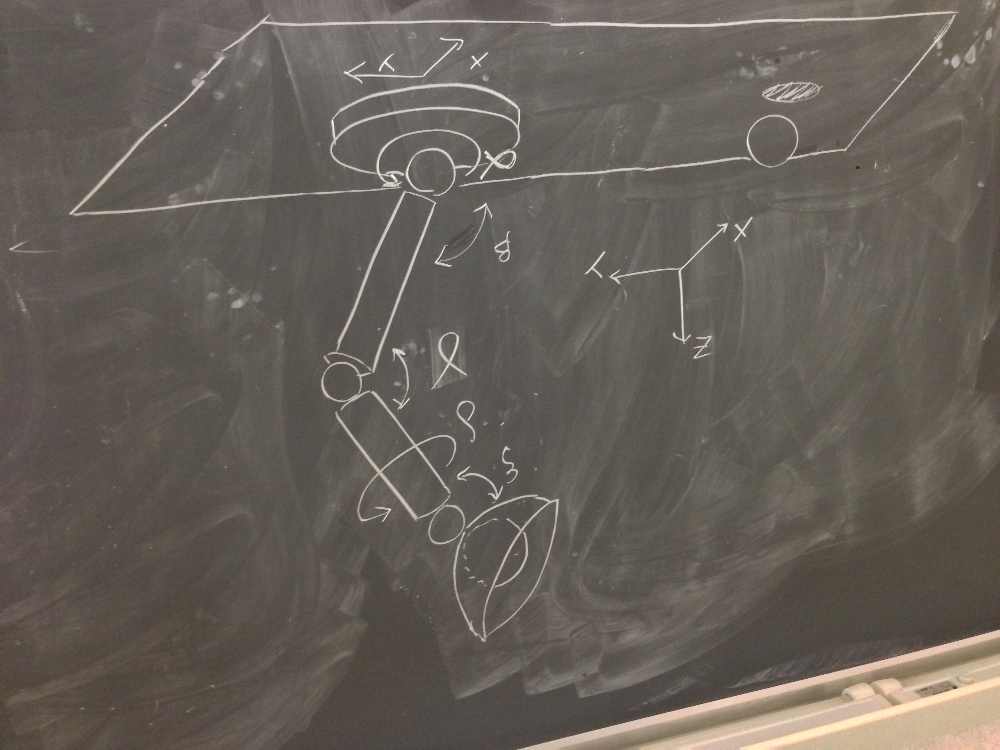

# Homework assignment n4
**Computational Visual Design Lab ([CVDLab](https://github.com/cvdlab))**  
**"Roma Tre" University, Rome, Italy**  
**Computational Graphics 2014**

## Subject

Produce a lamp model according to given specifications and following degrees of freedom:

```
Note: camera up vector on z axis.

alpha: [0, 2*PI] - rotate on z axis
beta: [0, PI/2] - rotate on x axis
gamma: [0, PI/2] - rotate on x axis
delta: [0, 2*PI] - rotate on z axis
epsilon: [0, PI/2] - rotate on x axis
switch: on/off
x: x position on the base plane
y: y position on the base plane
```



## Note

You should select z-axis as camera up vector. In other case rotation axes will not correspond to the provided ones.

## Caveat

The homework is **strictly personal**, and must be worked out by a single student. Violations will be persecuted :o)


# Assignment delivery

You must produce a file `lamp.html` and possibly some support files.
Such files must be contained in a directory entitled `2014-06-05`, pushed into the personal GitHub repository of the student: [https://github.com/cvdlab-cg/xxxxxx](https://github.com/cvdlab-cg/) where `xxxxxx` is the student ID  (matricola).

```
─── xxxxxx
    └── 2014-06-05
        ├── lamp.html
       (├── <anyname.js>)
       (...)
```

The delivery is strictly required within Monday Jun 9th before the beginnig of the lesson.

# Tips

#### Commit and push as frequently as you can
